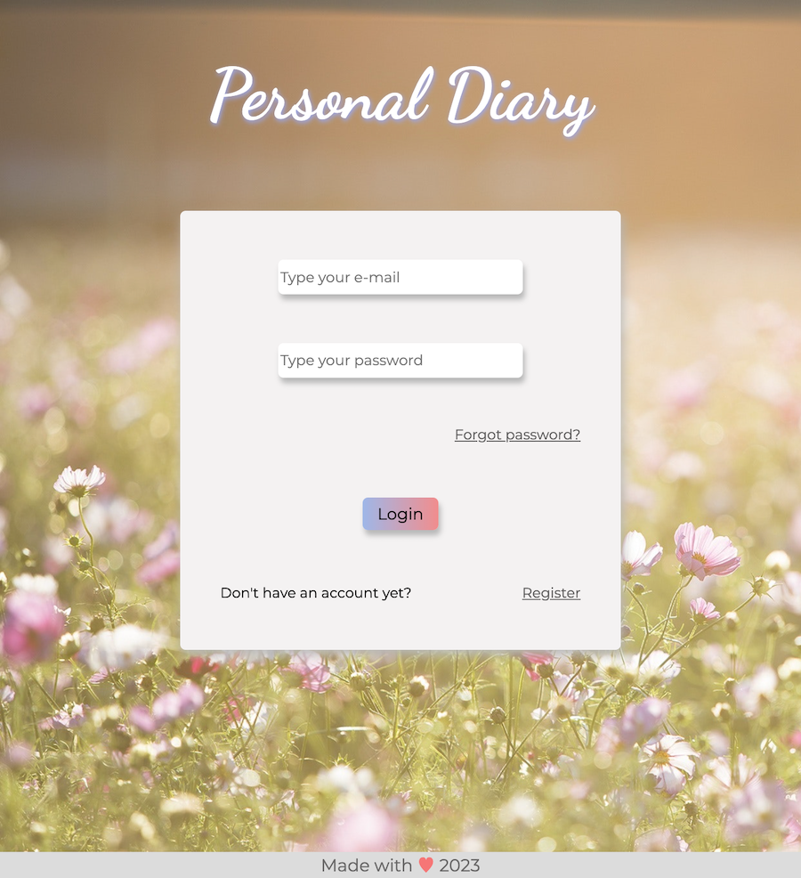

# personal-diary

## Description

The Personal Diary App is a secure and user-friendly web application. The app implements a robust login system to protect user data, ensuring that only authorized individuals can access their diary entries. This allows users to register and maintain a personal diary and notes online. With this app, users can privately document their thoughts, feelings, goals, stories, and more. Users can easily edit or delete their diary entries and notes, which enablies them to refine their content over time and maintain an up-to-date record of their personal journey. The app provides a convenient and secure platform for users to express themselves and preserve their precious memories.

[Click here to visit Personal-Diary app](https://personal-diary-o49e.onrender.com)

## Usage

### User Registration and Login

Users can create an account and log in to access their personal diary and task manager.

### Password Reset

Users can reset their passwords if they forget them by requesting a password reset email. The app sends an email with a secure reset token to the user's registered email address.

### Diary Entries

Users can create, view, edit, and delete diary entries. Each entry includes a title, text content, and the date it was created.

### Notes

Users can effortlessly create and delete notes for efficient task management.

### Responsive Design

The application is built with a responsive design, allowing users to access and use it seamlessly on various devices, including desktops, tablets, and mobile devices.

## Technologies used

- Node.js
- Express.js
- MongoDB
- Mongoose
- bcrypt
- Nodemailer
- EJS
- moment.js
- dotenv
- HTML/CSS
- JavaScript

## License

MIT
